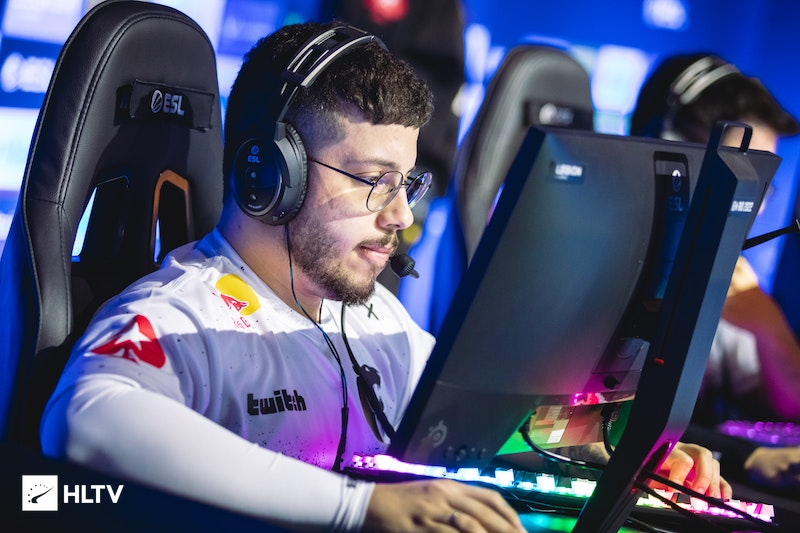
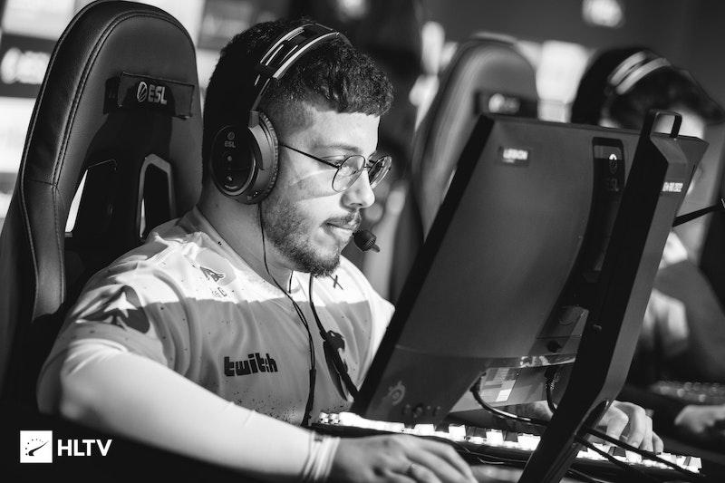
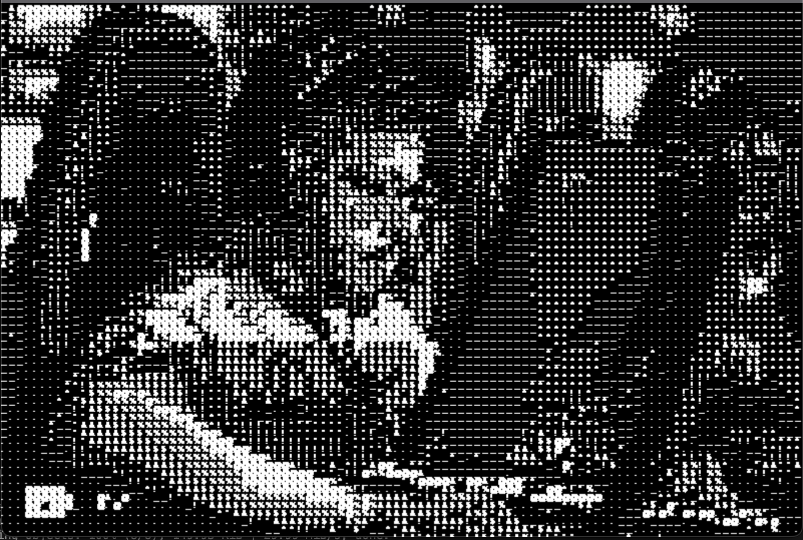
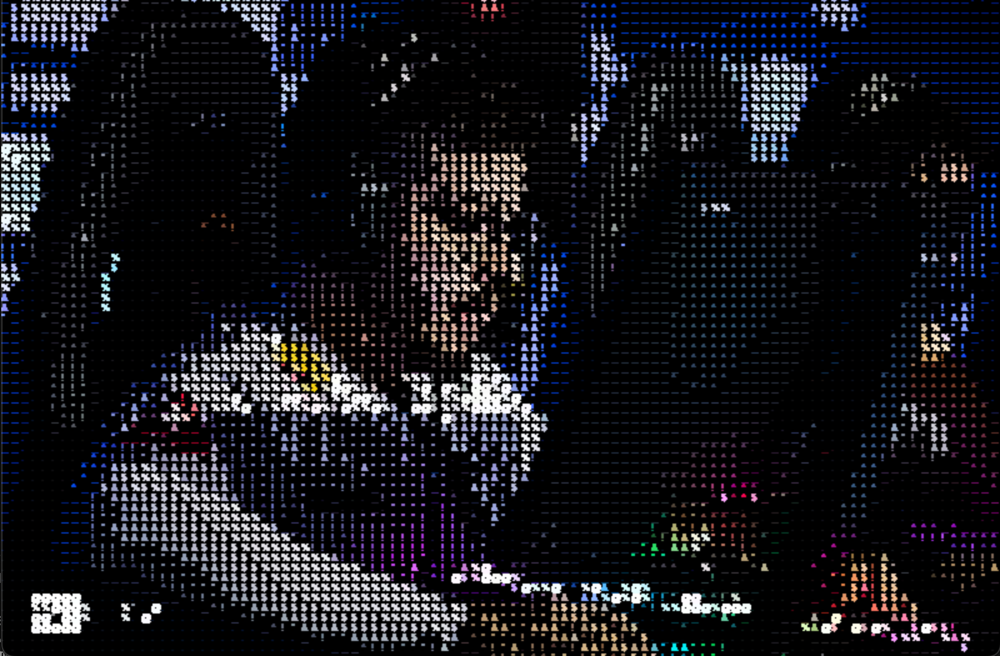

# ASCII Art Generator

Simple application that converts regular images to ASCII characters art.

## Explanation

Algorithm used to do this trick is as following. Firstly, we load image as it is.



After that it is being converted to grayscaled version.



Next, we traverse through all pixels and check their values.
Possible values are 0 - 255. Previously we have defined our array of symbols.

```python
SYMBOLS = [".", "_", "^", "!", "*", "&", "$", "%", "@"]
```

These symbols are ordered by the condition "how bright" they are. From brightest to the darkest.

Since there is 9 elements in the array and maximum value is 255, step for mapping element would be 28 (255 / 9 ~ 28). Then we check if element is less than or equal to 28, then it is brightest element (.). If that is not the case, then we check if element is less than 56 (28 + 28) and we return first element (\_) and so on.

Lastly, when we have all values for possible pixels, we have to display on the screen.



In the settings.py file we have configuratioon for symbols and pixel size. Symbols is array that are being used for elements presenting on the screen. Pixel size is used to determine distance between two successive elements.

Changing those parameters you can tweak this generator.

Also, there is possibility to display art in non-grayscale version. When asked if you want image to be grayscaled, just select N (No) and image will look like this:


